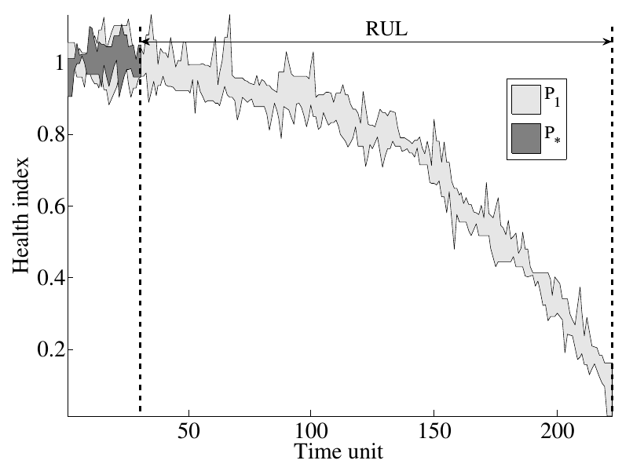

This is the implementation of [1], RULCLIPPER algorithm. 

## RULCLIPPER

RULCLIPPER is a similarity based prognostics methods with very few parameters and using computational geometry to perform comparison. The metric to compute similarities is based on coverage between training and partially observed testing data.



RULCLIPPER lead to very good performance on difficult datasets called CMAPSS aero-engines degradation datasets. The performance was measured on the full testing datasets using multiple metrics. RULCLIPPER outperformed many algorithms including neural networks, with very few parameters, even on the 2008 PHM data challenge, depictinig very good generalisation. 

## Getting Started

1. First go at [NASA PCOE](https://ti.arc.nasa.gov/tech/dash/groups/pcoe/prognostic-data-repository/). Download files in the section called: "Turbofan Engine Degradation Simulation Data Set" Those files datasets and also contain RUL_FD000x.txt which contains the Remaining Useful Life values (RUL) for x=1,2,3,4. The code also works for the 2008 data challenge (can be found on the same link).

2. Run `evaluate_similarity_polygon_rulclipper.m`. It contains the code within an example to reproduce RUL prediction for one instance in one testing dataset. Modify it as necessary to make loop over all testing datasets: you should obtain around S=272 for the cumulated 
score for dataset #1. See the file `ex2_loop_rulclipper__not_runnable_readme.m`.

3. If your are interested in computing the health indicators, then go in `health_indicators_estimation_cmapss.m`. Then you can use those HI for predictions. You can evaluate the impact of the features on the results.

The folder `RULCLIPPER - Prognostics - Data` provides matlab files with the health indicators (for checking).

## Cite 

If you make use of this code in your work, please refer to [1]:

```
@article{ramasso2014investigating,
  title={Investigating computational geometry for failure prognostics.},
  author={Ramasso, Emmanuel},
  journal={International Journal of prognostics and health management},
  volume={5},
  number={1},
  pages={005},
  year={2014}
}
```